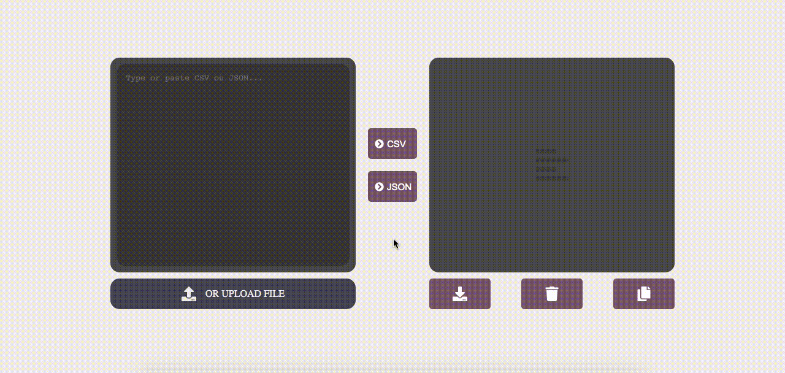

# JSON ↔️ CSV Converter

Here's a simple converter to both json and csv content. Made with pure HTML, CSS and javascript. 🤓

# :page_facing_up: Table of Contents

* [Features](#rocket-features)
* [Getting Started](#runner-getting-started)

# :rocket: Features

* 📁 Upload CSV or JSON file to convert
* 👇🏽 Download converted result
* ✌🏽 Copy converted result to your clipboard

# :runner: Getting Started

When you download or clone this repo, enter the project folder and just open index.html file in your web browser. 🎉

# 🤲🏼 Contributing

Feel free to contribute whith this repository or suggest better way to do it. Thank you!
